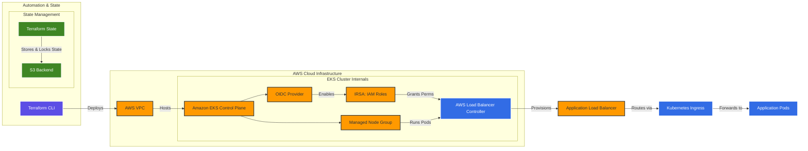

# Terraform EKS Infrastructure

Infrastructure as Code project for provisioning an AWS EKS cluster using Terraform.

## Components

* VPC
* Public and Private Subnets
* NAT Gateway
* Amazon EKS
* Managed Node Groups
* EKS Addons (CoreDNS, kube-proxy, VPC CNI)
* OIDC Provider
* IRSA (IAM Roles for Service Accounts)
* AWS Load Balancer Controller
* Remote Terraform State in Amazon S3

## Architecture

AWS: VPC, Public Subnets, Private Subnets, NAT Gateway, EKS, Managed Node Group, CoreDNS, kube-proxy, VPC CNI, AWS Load Balancer Controller

## Usage

terraform init

terraform plan

terraform apply

## Related Project

Application deployment repository:

helm-test

This repository provides the infrastructure layer used by the application deployment project.
